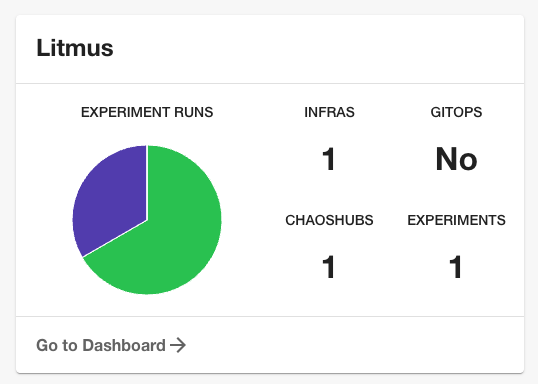

# backstage-plugin

> This plugin not published yet

## Plan

Check out [proposal](https://docs.google.com/document/d/1_ePJ36DwFrhFPhcxhxXX__yiNzW1KDL83L2lfF8oIcA/edit?usp=sharing)

## Features



TBD

## Prerequisite

1. Get Litmus Auth Token in the cookie
2. In the `app-config.yaml` file root directory, add litmus proxy and info like below
   ```yaml
   proxy:
     '/litmus':
       target: 'your-own-litmus-ui-url'
       changeOrigin: true
       headers:
         Authorization: Bearer ${LITMUS_AUTH_TOKEN}
   litmus:
     baseURL: 'your-own-litmus-ui-url'
   ```
3. Add your auth key to the environmental variables
   ```shell
   export LITMUS_AUTH_TOKEN="your-own-token"
   ```
4. Adding annotations and values to your component file.
   ```yaml
   apiVersion: backstage.io/v1alpha1
   kind: Component
   metadata:
     name: component-name
     description: 'description'
     annotations:
       litmuschaos.io/project-id: 'your-own-project-id'
   ```
5. Enabling frontend
   ```ts
   // packages/app/src/components/catalog/EntityPage.tsx
   const overviewContent = (
     <Grid container spacing={6} alignItems="stretch">
       // ...
       <EntitySwitch>
         <EntitySwitch.Case if={isLitmusAvailable}>
           <Grid item md={4} xs={12}>
             <EntityLitmusCard />
           </Grid>
         </EntitySwitch.Case>
       </EntitySwitch>
       // ...
     </Grid>
   );
   ```
