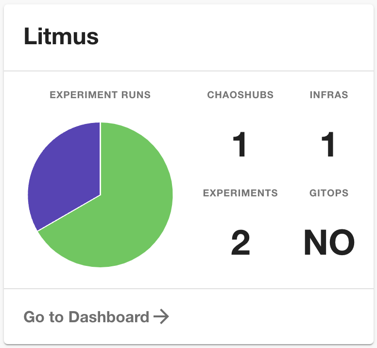
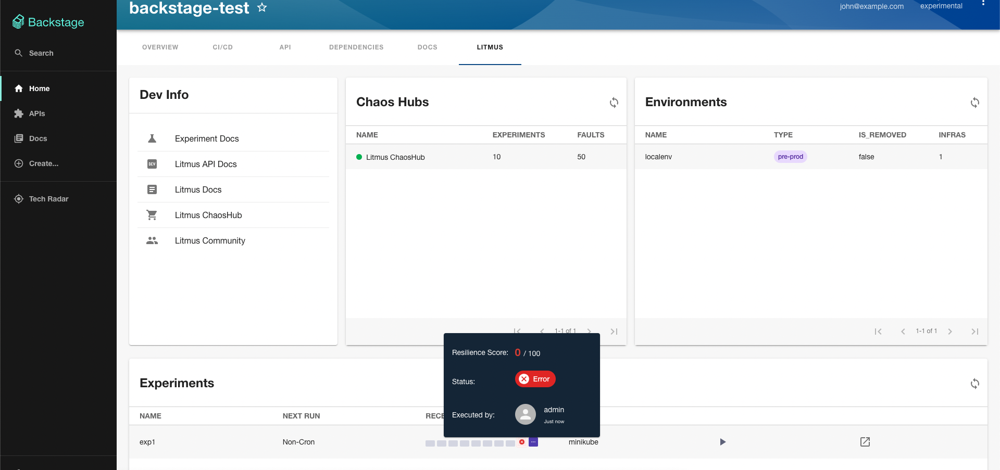
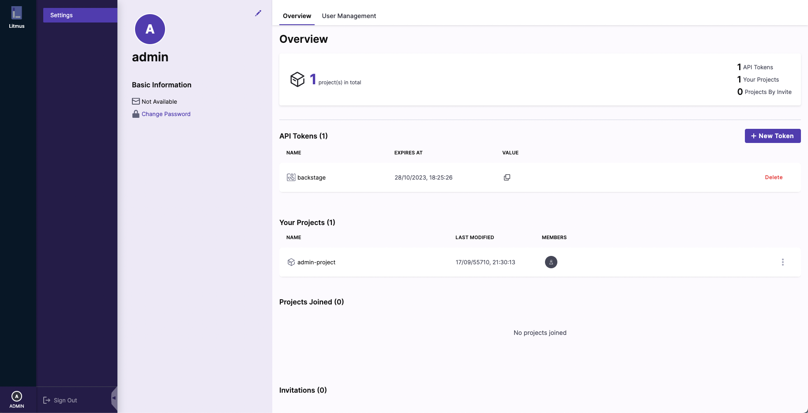
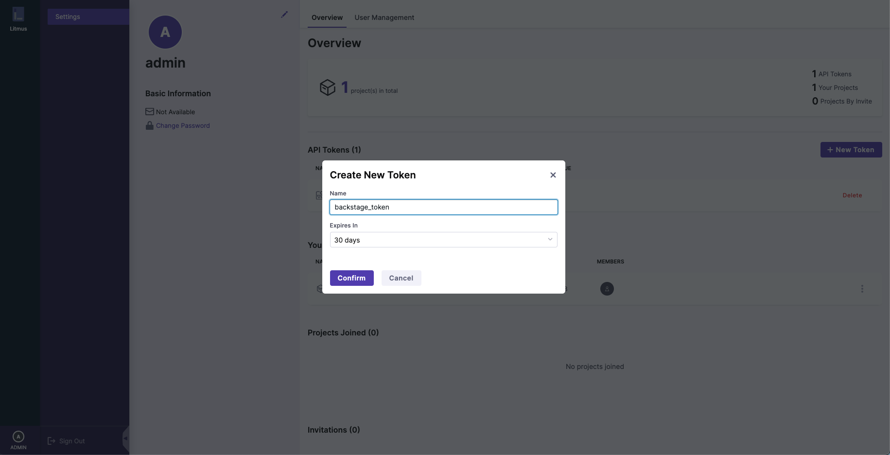

# backstage-plugin

[](https://badge.fury.io/js/backstage-plugin-litmus)

## Features

### EntityLitmusCard



### EntityLitmusContent



## Before you begin

- Compatible only with Litmus version [3.0.0](https://github.com/litmuschaos/litmus/releases/tag/3.0.0) or later.
- Please visit our [documentation site](https://docs.litmuschaos.io/docs/integrations/backstage) to get a detailed guide.

## Getting started

1. In the `./packages/app` project add the plugin.

   ```yaml
   yarn add backstage-plugin-litmus
   ```

2. Get Litmus API Token through the Litmus UI

   1. Click "SETTINGS" in the sidebar.
   2. Click "+ New Token" Button in the 'API Tokens' section.
      
   3. Enter your information and click "Confirm".
      
   4. Get the token in the "VALUE" column.

3. In the `app-config.yaml` file root directory, add litmus proxy and info like below
   ```yaml
   proxy:
     '/litmus':
       target: 'your-own-litmus-ui-url'
       changeOrigin: true
       headers:
         Authorization: 'Bearer ${LITMUS_AUTH_TOKEN}'
   litmus:
     baseUrl: 'your-own-litmus-ui-url'
     apiToken: ${LITMUS_AUTH_TOKEN}
   ```
4. Add your auth key to the environmental variables
   ```shell
   export LITMUS_AUTH_TOKEN="your-own-token"
   ```
5. Adding annotations and values to your component file.
   ```yaml
   apiVersion: backstage.io/v1alpha1
   kind: Component
   metadata:
     name: component-name
     description: 'description'
     annotations:
       litmuschaos.io/project-id: 'your-own-project-id'
   ```
6. Enabling frontend

   ```ts
   // packages/app/src/components/catalog/EntityPage.tsx
   import {
     isLitmusAvailable,
     EntityLitmusCard,
     EntityLitmusContent,
   } from 'backstage-plugin-litmus';
   // ...
   const overviewContent = (
     <Grid container spacing={6} alignItems="stretch">
       // ...
       <EntitySwitch>
         <EntitySwitch.Case if={isLitmusAvailable}>
           <Grid item md={4} xs={12}>
             <EntityLitmusCard />
           </Grid>
         </EntitySwitch.Case>
       </EntitySwitch>
       // ...
     </Grid>
   );
   // ...
   const serviceEntityPage = (
     <EntityLayout>
       // ...
       <EntityLayout.Route path="/litmus" title="Litmus">
         <EntityLitmusContent />
       </EntityLayout.Route>
       // ...
     </EntityLayout>
   );
   ```

---

> This plugin is based on [proposal documentation](https://docs.google.com/document/d/1_ePJ36DwFrhFPhcxhxXX__yiNzW1KDL83L2lfF8oIcA/edit?usp=sharing)
